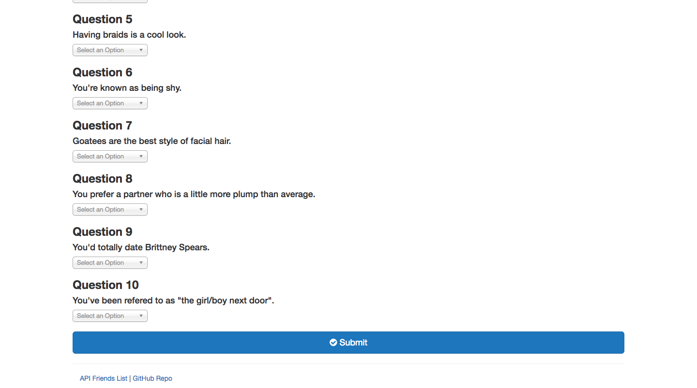

# Friend Finder
This full stack app compares users and matches them with another compatible user. This app uses the express, path, and body-parser node packages to route between different paths. This app is depoyed using Heroku.

## How to use the app:
* Go to this link: https://pure-citadel-25503.herokuapp.com/ .
* Enter your name and a link to a photo of you.
* Chose a value from 1-5 in response to the question.
* Press enter to see your match!

## Other info:

* Click on the "API Friends List" link to see the data stored in the API for different users. Note: it is recommend that you view this in the browser with a JSON formatter plug-in.
* Click on the "GitHub Repo" link to see the GitHub repository for the app.

## Images:

  
   
  
   
  

